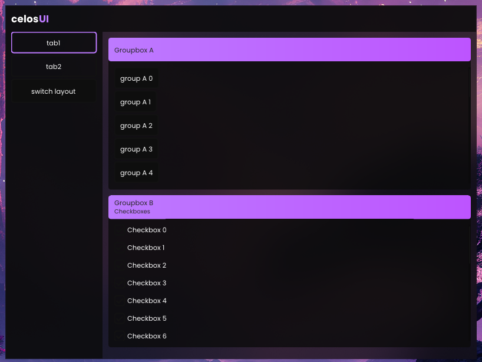

# CelosUI
A heavily modified version of ImGui with added functionality.

## Current features
* All of the ImGui features
* Animations
* New and improved widgets and components
* Map variables
* Automatic layouts
* Win32 windows and effects
* Custom theme support
* DirectX 11
* New font system
* Tabs
* InputSystem

## To implement
* Freetype
* Image Loading
* Button Layout (Tabs)
* Theme Lerp & PushStyleColor / Var
* Color Picker
* Scrollbar.h
* Linux support
* Other rendering backends for compatibility
* Shader support

## Optional
* redo font spacing code
* redo imgui::endchild pushclip, combo pushclip, begin pushbclip
* RenderFrameFunctions
* for animations using renderframeanimations, add an index that is reset on every frame to avoid mixing up

## Known issues
* Fonts are required to be in the same folder as the executable and can be found within the assets folder. They will not work if executed from Visual Studio.
* Adding rounding to a Win32 window that has blur will result in weird looking edges (solution is to use an actual blur shader, which I have not added support for yet)

To find todo's, search all files for "CTODO". This was in order to prevent ImGui's todos from interfering with my own.